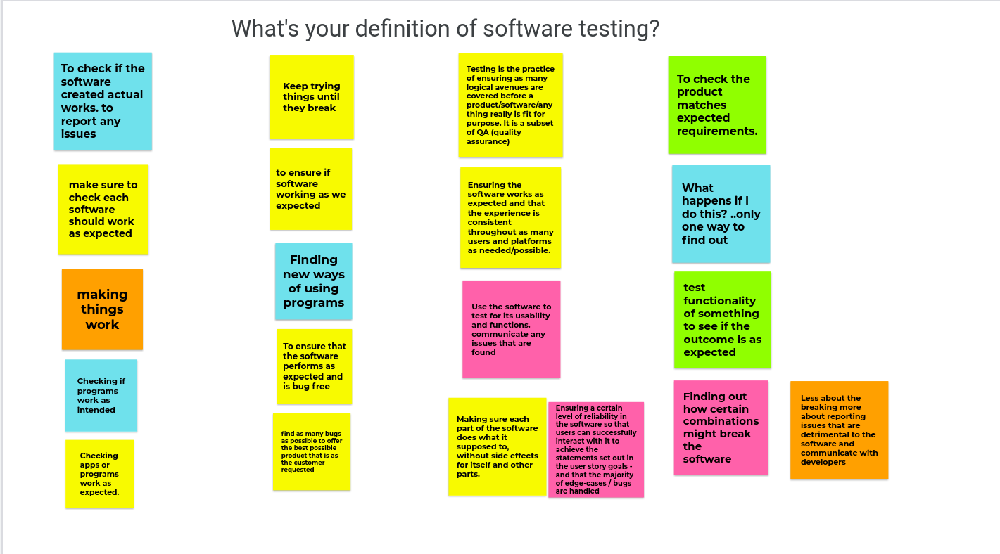

This week, I started **The Coders Guild [Software Testing bootcamp](https://thecodersguild.org.uk/blog/try-yourself-out-as-a-software-testing-professional/)**. It's a very exciting pilot scheme aiming to improve the skills gap across Software Testing, Development and UX Design. I've signed up to the testing bootcamp both because I want to see if it can be an alternate career path for me in the Tech sector, but also I think it will help me to writer better quality code as a developer.

Over the first few sessions, we’ve been learning what part the software testing team play in the creation of a product. We were initially asked what we thought, and then at the next session posted a revised definition along-side.

We were introduced to various definitions:

>“Testing is an infinite process of comparing the invisible to the ambiguous in order to avoid the unthinkable happening to the anonymous.” - **James Bach - Co-Creator of session based testing**
>
>“The principle objective of software testing is to give confidence in the software” – **Anonymous**
>
>“What could happen given every possible, practical scenario” -
**Ady Stokes - Coders Guild Instructor**

No-one has a perfect definition, but broadly, testing revolves around identifying risks and making sure they are mitigated, and doing so to an extent that the software can be considered reliable.

What has also been equally important is clarifying what testers **DON’T DO**:

> • Testers are not the gatekeepers of 'quality'
>
 >• Testers don’t ‘break things’

I have seen various memes from dev around testers ‘breaking things’. My personal favourite is Mr Bean trying out a bed, going from prodding it, to full on trampolining on it. Entertaining as it may be, it's not quite the case. Quality of code comes from many different factors: performance, accessibility, security to name a few, and if any factor has weaknesses - they need resolving! As one of our instructors Ady put it, it is dispelling the illusion that it works, not breaking it. 

In my development projects so far, I’ve felt uneasy about my front-end code, because I know it is ‘happy path’ only code i.e it can do want it was designed to, but is not restricted to only that! So I’m looking forward to revisiting and refactoring it with the skills picked up on this course.

Finally I wanted to try explain the necessity of testing, and why it's done in a non-technical way, and my attempt is making an analogy that it's like buying a house. 

 The happy path is if it meets your requirements, say like a south-facing with garden within budget – brilliant! But testing it is looking deeper at issues that could arise. Are the entry-ways secure? Are there damp problems that could spread? Is it structurally sound? Of course you’d want to know the extent of any risks, and it really wouldn’t be sensible to proceed without that knowledge. 

 However equally as with testing, it’s not realistic to test every possible scenario, and there may still be some unexpected surprises once you have the keys(- or for software - production goes live)! But if you covered the major and  most likely concerns beforehand, (hopefully) those things are only small quick adjustments, before you get to living happily ever after :) 