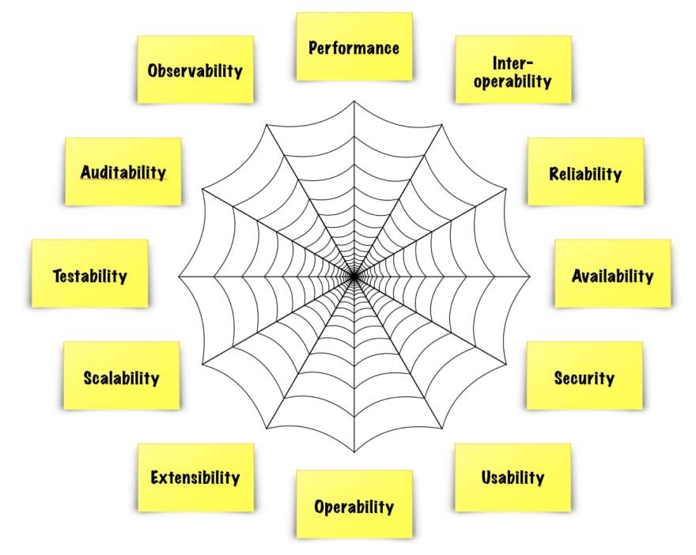
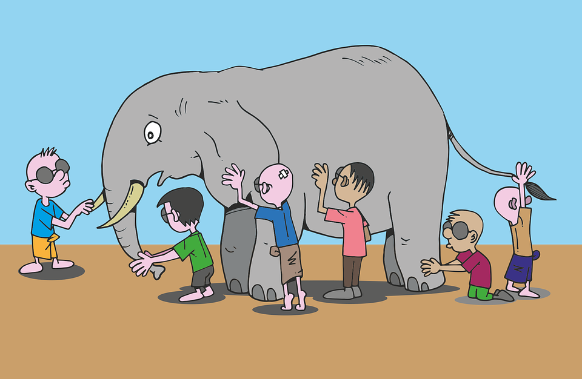

n our second session with The Coders Guild, we explored the concept of ‘quality’ in the software development lifecycle.

 The first part is a summary of the key points of the lecture, if you want to skip to the titular talking point - it's the final block.

# What is Quality?

As with defining software testing, multiple definitions exist for quality in Software Development:

***ISTQB*** - The totality of functionality and features of a software product that bear on its ability to satisfy stated or implied needs.

***IEEE*** - The degree to which a system, component, or process meets specified requirements. The degree to which a system, component, or process meets customer or user needs or expectations. 

Our instructor Suman (QA Lead) focussed her criteria for successfully creating quality around three key points:

- ***Quality is a habit*** – it is built into product throughout the entire process of creating it – it is not something that can be added at the end

- You need to be ***doing it right when no-one is looking*** – taking no shortcuts and spending time on really understanding the requirements set out and ensuring the product meets them

- ***Mindset*** → quality inevitably differs from person to person and this needs to be taken into account. Users will be diverse and think differently, and the product needs to be able to meet these differing criteria.

In short: Build the right thing, and build the thing right.

## What are the attributes of quality?

## What are the benefits of high quality software?

→ **Fewer issues in the long run**, high quality allows more bugs to be prevented and caught before production.

→ **Savings** – extending on the previous, once something has gone to production it is often more difficult and costly to fix

→ First impressions – high quality should result in a **good user experience** and while there may be improvements to be made, the MVP produced should have a good UX experience otherwise users may not return 

→ Good UX leads to **customer loyalty** – and customers will recommend the product ! 

→ By default a high-quality piece of software will have high efficiency

## How can we gauge the level of Quality?

Firstly, we cannot improve what we cannot measure, so can we define low, average and high quality? As a example: 1-2 seconds of load time is high quality, while 3-6 is average but 7+ is low.

Factors that are important to quality:

- Fitness for use
- Freedom from errors and failures
- Customer Satisfaction

A more detailed approach is to consider Software Quality Metrics. These can split into three categories:
### Product Quality Metrics:
- Meantime to failures
- Defect density
- How many customers reported the problem
- Customer Satisfaction

### In-Process Quality Metrics

- Phase-Based defect removal
- Effectiveness of defects removal
- Defect density during testing
- Defect arrival pattern

### Maintenance Quality metrics

- Fix backlog
- Backlog management index
- fix response time
- percentage of delinquent fixes  
  

***
## Testing and Quality
 *Isn't testing meant to deliver and ensure high quality?*

 Our instructor Suman is QA Lead. She defines the role as being a ‘Quality Advocate’ over ‘Quality Assurance’ – as quality cannot be assured. However when applied correctly combining QA and testing should lead to high quality.

Differentiating QA and Testing: 

**Quality Assurance/Quality:**  an “Umbrella Activity” that is *applied throughout the entire software process* to achieve “high–quality” software. It aims to *prevent* bugs appearing and to improve the development process. 

**Testing:** concerned with the *detection* of bugs before a user had chance to uncover and experience them.  

While finding bugs is important in improving quality, it is only highlighting the issues not providing solutions, nor is it exhaustive so cannot alone ensure quality.

## So, who is responsible for quality ?

Ultimately, everyone involved in the product is accountable for quality at every stage of the process. While quality and testing are linked, testing alone cannot ensure quality, and testers should not be seen as the gatekeepers of quality. 

### The Blind Men and the Elephant

The session ended reflecting on this parable

The moral is a good practise to have as a tester. Remembering to take a step back from focussing on your responsibilities, to look at the project as a whole and take into account others perspectives. Collaboration and communication are integral to seeing and understanding the project in its entirety - it is greater than the sum of its parts. 

