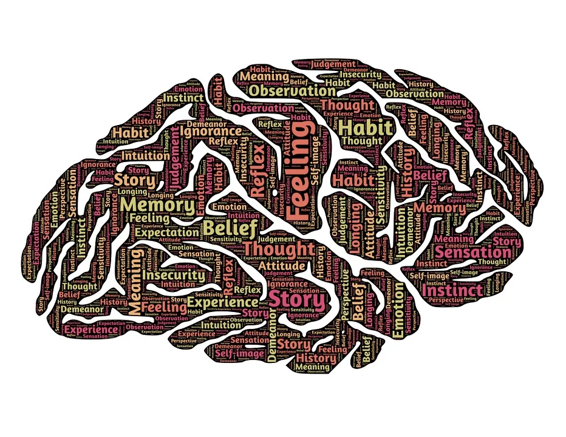
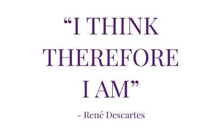

# The Testers Mindset

Today’s session focussed around the idea of a ‘tester’s mindset’ -what is involves and what shapes it. Mindset is important because it affects how you solve different kinds of problems, and whether you can recognise them in the first place. While everyone’s is unique, the more diverse the team the stronger the approach to testing a project is – exactly why this course is running! 

## So what goes into a mindset?
It can comprise of behaviours, thought patterns, attributes and personality traits. It can be formed by past experiences, explicit knowledge, assumed knowledge and **biases** (more on this last one later). 

In software testing the use of **heuristics** is common aid used to challenge a tester to focus in on an area of testing and to lead to new ideas to investigate in their testing, challenging their mindset.

## Heuristics and Mnemonics

We use them all the time unknowingly, for example throwing it back to school days, do you remember, Big Elephants Can Always Understand Small Elephants or My Very Earthly Mother Just Served Up New Potatoes – (I don’t know what the updated version is, so Pluto stays.) 

*So what’s the difference?* 

**Heuristics: - thinking techniques**

 - Heuristics are mental shortcuts that allow people to solve problems and make judgments quickly and efficiently. In the 99 second intro to Heuristics from the Ministry of Testing they are defined as *fallible methods for solving a problem (in software testing) and a trigger for stemming ideas*. [**](https://www.ministryoftesting.com/dojo/series/99-second-introductions-from-software-testing-clinic/lessons/99-second-introduction-to-heuristics) 

**Mnemonics: memory techniques**
- Are a type of heuristic - using songs, acronyms or catchphrases to help us recall something.

As a group we looked at examples of the Goldilocks heuristic for boundary testing, and James Bach’s FEW HICCUPS, but in the interest of this not becoming a monster of a post I’m making a second post on applying them to one of my coding projects. 
 
  

## Cognitive Bias
While useful tools, it is crucial to remember they are fallible, and this is  linked to the bias we inevitably have in our mindset. When we make decisions, we typically look to our previous experiences to think of similar decisions and their solutions. This may be efficient, but is a form of bias that does not guarantee the best solution. So when testing, instead of going with the solution that stands out first in our memory, or that we have used most often, we should challenge that instinct, and step back to assess if it is a good fit before we continue. 

## So what’s your testing mindset?

At the session end, we were asked to think about our tester’s mindset, and how our previous experiences have helped us to develop.

- **Inquisitive** –   When I learn something new I'm not content with knowing how to apply it, I want to understand how and why it works too. 

- **Listener** – In meetings I tend to listen and process what others put forward, then contribute.
I like to absorb the information presented, compare it to my initial thoughts and integrate them before I make my own contribution. In our course, the one phrase that pops up without fail every week is ‘it depends’ – because context is key! This would be valuable for understanding the project requirements, and also in discussions with devs about what may need to change, and why it currently is the way it is.

- **Collaborative** – While I work well alone, I think I do best when I can discuss with others to get different perspectives and can then reflect those differences into my work. This would be valuable in talking with testing team members but also in feedback discussions with other project stakeholders like the devs or project managers.

As a side-note I’m a fan of the rubber duck method from The Pragmatic Programmer for my current solo project work* - although it’s normally the family pets that draw the short straw of of hearing me ramble on till the lightbulb moment. (*a programmer who explains their code line-by-line aloud to a rubber duck on their desk to aid debugging) 

- **Worrier** – it's very nice to turn this into a positive! I do have a natural inclination to think of all the ways something could gopear-shaped, before thinking of how it could go right, but when applied to a software testing, especially in exploratory testing I think this can be a positive part of my mindset.

- **Persistent** – I really do not like to give up on a problem or find a way around it. The downside to this working solo on my portfolio is I maaay give too much time to minor problems as I deep dive them, but as part of a team I would absolutely seek to pair or mob an issue to crack it :)

### Past experiences

Reflecting on it, I do think my past experiences have actually developed a testing mindset. When I worked at an EFL language school I wrote lesson plans that would be used by hundreds of teachers in different classroom scenarios. I had to think through the tasks I set, mixing in tasks requiring no materials and provide viable adjustments or alternatives to potentially tricky situations. i.e. not all teachers have guaranteed access to a whiteboard, some may not have the space where a movement game could be played. When I was teaching and pupil didn’t understand a concept, I had to try find the sticking point from their perspective and explain in a different way. 

In my customer services role, I was ‘bug spotting’ without realising it. Whenever I found a potential flaw or repeating issue in the flow of placing an order from quotation through to shipping, I wrote it down and tried to find a solution, or spoke about it with my manager. 

  

Finally, I did not think my undergrad in French could ever be shoehorned into working in the tech sector, but with bias – I’ve cracked it. 

Back in the 17th century René Descartes wrote his ‘Discourse on the Method’. If this is ringing faint bells it is probably because of the line ‘cogito ergo sum’, ‘je pense donc je suis’: ‘I think therefore I am’. After a couple of hundred of pages of discussion, Descartes concluded that this was the only thing he could be certain of. Not necessarily the most helpful approach when taken literally, but a healthy reminder to regularly check in on your biases!