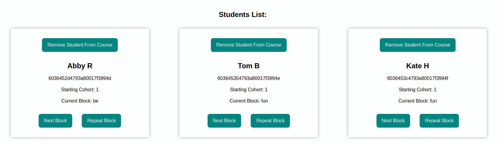

We were challenged to go away and apply one of the Heuristics we had learnt, and I decided why not try it on some of my own code. I knew it was far from perfect or finished, but wow there is a lot that could be improved – and that’s only the things that I’ve considered in the 10 minute block to test it.

The code is from a Northcoders mini-sprint, where we designed a dashboard that displays information from an API for a database about the students on the course, and allows the user to perform CRUD operations. I chose to focus in on the Add Student form, which needs a student name and a number.

I've gone with the Goldilocks heuristic; too much, not enough, just right. For reference, here is the form, and some normal examples:

(As a side note, I am not considering deliberate user errors targeting security, like attempting basic SQL injection or XSS, rather what a normal user may input)

  

  

## Names
1. What are the minimum and maximum name values, if any?
2. Can I submit without sending anything?
3. Can I input any characters that are not alphabetical / Not-ASCII?
4. What impact do spaces have?
5. Can letters be repeated?

### Conclusion:

It passed 1, maybe 1.5 of those:

  

As a required field, something had to be in it, and it also cut down multiple spaces in a row to just one. But as you can see, afterwards it was a bit of a free for all.

*Actions required:*
- Set minimum and maximum character input
- Limit permitted characters - with a Regex? 
- Limit character repeats to 2/3 ? 

## Starting Cohort
1. Will it accept no information?
2. Can non-numeric figures be inputted?
3. Can invalid negative numbers be admitted?
4. Is there a range of valid numbers

  

### Conclusion:

This fared somewhat better thanks to the database restrictions, but still was problematic. Negatives and decimals were accepted, and improbable cohort numbers were also accepted.

*Actions required:*

- Restrict to 0-9 characters only, no decimals . and no minuses -
- Refactor to 'number' input type or even more restrictive input e.g. dropdown option?

I think in a broader refactor, the information on the next cohorts could be found from the API and used to limit the choice to only cohorts marked as active, as it's equally unlikely that a new student is added for a cohort that is past the first block.

## Other Observations for Usability:

  

- There is no form of error messaging using either database error responses or validation within the form

- The submit button has no indication of being the focus when tabbed to

- The input fields do not respond well to different screen sizes

In short, there is alot to consider when coding elements that involve user interactions and inputs. I will definitely be taking the points raised from this and applying them to future projects!